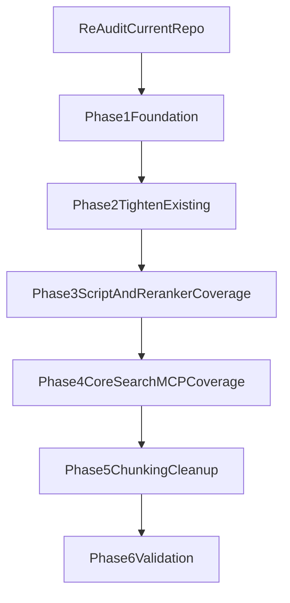

# Unit Test Remediation Plan (Second Pass)

## Goals

- Revalidate prior findings against recent updates and keep only currently accurate items.
- Increase regression signal by removing permissive assertions and stale test contracts.
- Add missing coverage for newly added installer/prereq/reranker script paths.
- Keep all new tests deterministic, side-effect free, and CI safe.

## Revalidated Findings (Current State)

- Shared-fixture gap is still present (no repo-level [tests/conftest.py](c:/Users/tline/Context-Local-Repo/claude-context-local/tests/conftest.py)).
- Low-signal tests remain in [test_mcp_server.py](c:/Users/tline/Context-Local-Repo/claude-context-local/tests/unit/test_mcp_server.py), [test_mcp_tool_descriptions.py](c:/Users/tline/Context-Local-Repo/claude-context-local/tests/unit/test_mcp_tool_descriptions.py), and permissive sections in [test_mcp_project_storage.py](c:/Users/tline/Context-Local-Repo/claude-context-local/tests/integration/test_mcp_project_storage.py) and [test_auto_reindex.py](c:/Users/tline/Context-Local-Repo/claude-context-local/tests/integration/test_auto_reindex.py).
- New scripts currently untested:
  - [prereqs.sh](c:/Users/tline/Context-Local-Repo/claude-context-local/scripts/prereqs.sh)
  - [prereqs.ps1](c:/Users/tline/Context-Local-Repo/claude-context-local/scripts/prereqs.ps1)
  - [download_reranker_standalone.py](c:/Users/tline/Context-Local-Repo/claude-context-local/scripts/download_reranker_standalone.py)
- Runtime reranker logic has no direct tests in [reranker.py](c:/Users/tline/Context-Local-Repo/claude-context-local/reranking/reranker.py).

## Implementation Strategy

### Phase 1: Foundation and Determinism

- Add [tests/conftest.py](c:/Users/tline/Context-Local-Repo/claude-context-local/tests/conftest.py) with:
  - `mock_storage_dir` shared fixture
  - deterministic RNG/helper fixture
  - env-isolation helper for `CODE_SEARCH_*`, `HOME`, and `USERPROFILE` where relevant
- Normalize deterministic data generation in integration tests (avoid Python `hash()` dependency where used for seeds).

### Phase 2: Tighten Existing Tests

- Replace import-only test in [test_mcp_server.py](c:/Users/tline/Context-Local-Repo/claude-context-local/tests/unit/test_mcp_server.py) with behavior-level tests (tool presence/response schema via public surfaces).
- Update brittle CLI copy assertions in [test_cli.py](c:/Users/tline/Context-Local-Repo/claude-context-local/tests/unit/test_cli.py) to stable command-contract checks.
- Remove permissive pass conditions (`>= 0`, optional error acceptance) in:
  - [test_mcp_project_storage.py](c:/Users/tline/Context-Local-Repo/claude-context-local/tests/integration/test_mcp_project_storage.py)
  - [test_auto_reindex.py](c:/Users/tline/Context-Local-Repo/claude-context-local/tests/integration/test_auto_reindex.py)
- Keep skipped tests minimal by removing dead bodies in [test_full_flow.py](c:/Users/tline/Context-Local-Repo/claude-context-local/tests/integration/test_full_flow.py).

### Phase 3: Add Script and Reranker Coverage

- Add [tests/unit/test_download_reranker_standalone.py](c:/Users/tline/Context-Local-Repo/claude-context-local/tests/unit/test_download_reranker_standalone.py):
  - success path with mocked tokenizer/model/config writer
  - auth/message transformation on download failure
  - default storage-dir behavior and CLI exit contract
- Add [tests/unit/test_prereqs_sh.py](c:/Users/tline/Context-Local-Repo/claude-context-local/tests/unit/test_prereqs_sh.py):
  - non-interactive behavior
  - missing dependency summary behavior
  - install-command suppression via PATH shims
- Add [tests/unit/test_prereqs_ps1.py](c:/Users/tline/Context-Local-Repo/claude-context-local/tests/unit/test_prereqs_ps1.py):
  - `-NonInteractive` behavior and no-install guarantees
  - version parsing and missing-tool branches
  - no-winget guidance path
- Add [tests/unit/test_reranker.py](c:/Users/tline/Context-Local-Repo/claude-context-local/tests/unit/test_reranker.py):
  - lazy loading and prompt contract
  - deterministic yes/no scoring and sorting
  - top_k truncation, metadata enrichment, and cleanup behavior

### Phase 4: Add Core Search/MCP Unit Coverage

- Create [tests/unit/test_indexer.py](c:/Users/tline/Context-Local-Repo/claude-context-local/tests/unit/test_indexer.py):
  - embedding-dimension mismatch handling
  - filter clause exactness and escaping behavior
  - graceful failure behavior in search/get-by-id branches
  - similar-chunk behavior (exclude self, metadata contracts)
- Create [tests/unit/test_searcher.py](c:/Users/tline/Context-Local-Repo/claude-context-local/tests/unit/test_searcher.py):
  - ranking helper methods (`_is_entity_like_query`, boosts)
  - suggestion generation boundaries and empty-state behavior
  - reranker enabled/fallback behavior (if reranker path is now in search flow)
  - deterministic ranking order for canonical query types
- Create [tests/unit/test_code_search_server.py](c:/Users/tline/Context-Local-Repo/claude-context-local/tests/unit/test_code_search_server.py):
  - input validation (`query`, `k`, invalid project paths)
  - stable JSON error/success schema checks
  - cross-project non-mutation invariant (`project_path` should not alter active project)

### Phase 5: Rationalize Overlap Across Chunking Tests

- Re-scope [test_multi_language.py](c:/Users/tline/Context-Local-Repo/claude-context-local/tests/unit/test_multi_language.py) to router/fallback/config behavior.
- Keep language-specific extraction semantics in dedicated files (e.g., [test_python_chunker.py](c:/Users/tline/Context-Local-Repo/claude-context-local/tests/unit/test_python_chunker.py), [test_javascript_chunker.py](c:/Users/tline/Context-Local-Repo/claude-context-local/tests/unit/test_javascript_chunker.py)).
- Parameterize repeated extension-driven checks to reduce redundancy and maintenance cost.

### Phase 6: Validation and Flake Control

- Mark environment-sensitive tests (`slow`, `gpu`) and relax raw timing assertions to avoid machine-noise failures.
- Execute staged test runs:
  - new script tests
  - new reranker/runtime tests
  - touched integration tests
  - full `pytest`
- Ensure script tests do not touch real package managers/network by using subprocess with command shims.

## Proposed Workstream Diagram

## Acceptance Criteria

- Shared fixtures exist and are used across integration suites that require isolated storage.
- Installer/prereq/reranker script tests exist and run without network or global side effects.
- Existing permissive assertions are replaced with strict behavior checks.
- New unit coverage exists for reranker runtime and core search/MCP modules.
- Updated suite passes under marker rules in [pytest.ini](c:/Users/tline/Context-Local-Repo/claude-context-local/pytest.ini).

